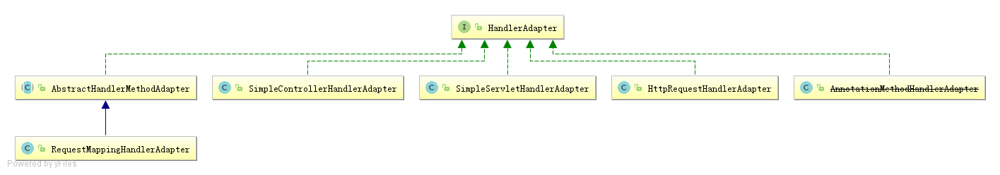

# HandlerAdapter

`HandlerAdapter`是SpringMVC的核心接口之一，主要用于调用具体的handler处理请求，并根据handler返回结果，返回一个`ModelAndView`实例。

`HandlerAdapter`接口定义了3个方法：

- `bolean supports(Object handler)`：返回当前`HandlerAdapter`是否支持给定的handler实例

- `ModelAndView handle(HttpServletRequest request, HttpServletResponse response, Object handler)`：使用给定的handler处理请求，并返回`ModelAndView`

- `long getLastModified(HttpServletRequest request, Object handler)`：与`HttpServlet`具有相同的约定，即返回最后一次修改request对象的时间，如果不支持则返回-1

## 类层次结构

- `AbstractHandlerMethodAdapter`：抽象基类，支持`HandlerMethod`类型的handler

- `RequestMappingHandlerAdapter`：继承自`AbstractHandlerMethodAdapter`，支持通过`@RequestMapping`定义的具有方法参数和返回类型的`HandlerMethods`；并可以自定义参数解析器和返回值处理器，或重新配置参数解析器和返回值处理器

- `SimpleServletHandlerAdapter`：支持`Servlet`类型的handler

- `SimpleControllerHandlerAdapter`：支持实现`Controller`接口的handler

- `HttpRequestHandlerAdapter`：支持`HttpRequestHandler`类型的handler

- `AnnotationMethodHandlerAdapter`：已经被`@Deprecated`标记，被`RequestMappingHandlerAdapter`代替

>  `AnnotationMethodHandlerAdapter`自3.2之后就被废弃了，所以不进行分析。

