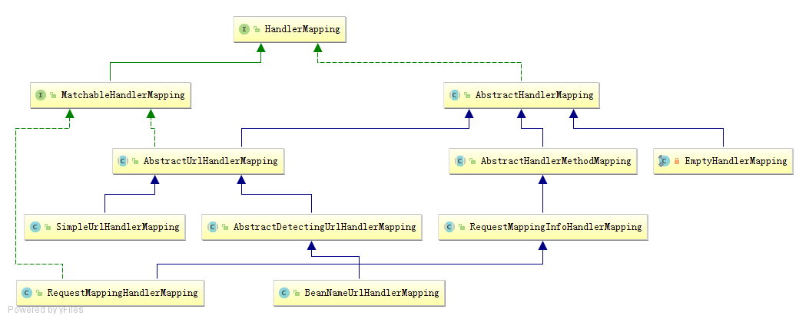

# HandlerMapping之模版方法模式



从HandlerMapping的类层次结构可以看出所有实现类都继承自AbstractHandlerMapping。

## AbstractHandlerMapping

AbstractHandlerMapping是HandlerMapping的抽象实现，其定义了根据Handler以及配置的拦截器来生成HandlerExecutionChain的逻辑，但将根据request获取Handler的逻辑交由子类实现。

```java
public final HandlerExecutionChain getHandler(HttpServletRequest request) throws Exception {

		Object handler = getHandlerInternal(request);
		// 省略其他代码

		HandlerExecutionChain executionChain = getHandlerExecutionChain(handler, request);
		// 省略其他代码
		return executionChain;
	}
	
protected abstract Object getHandlerInternal(HttpServletRequest request) throws Exception;
```

从上述代码可以看出，AbstractHandlerMapping定义了生成HandlerExecutionChain的算法结构，而如何获取Handler，则由子类来实现。


