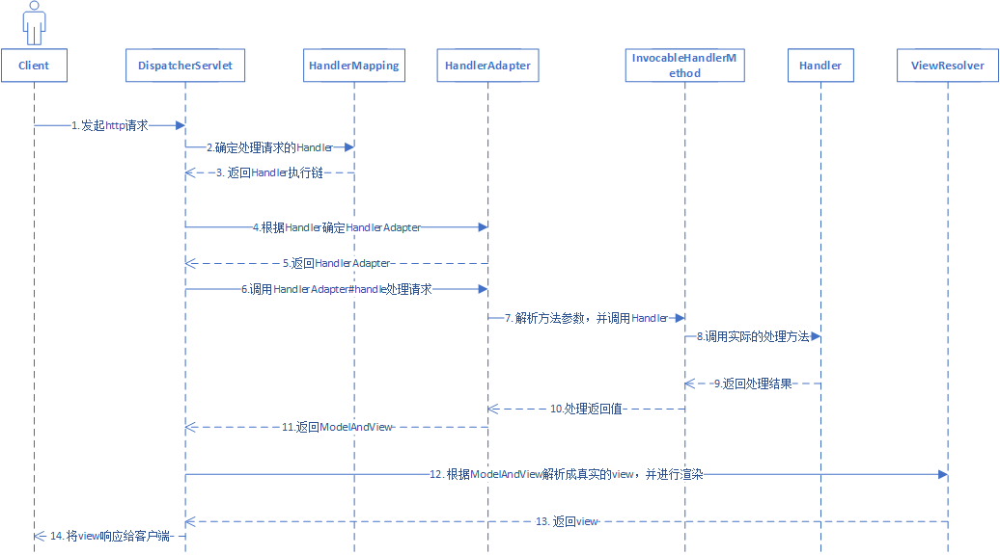

# 带着问题学习SpringMVC
Spring MVC是Spring基于MVC(model-view-controller)架构的web框架。Spring MVC是围绕`DispatcherServlet`设计的，核心组件有：`DispatcherServlet`,`HandlerAdapter`,`HandlerMethod`,`Controller`,`ModelAndView`,`ViewResolver`,`HandlerMapping`。

- DispatcherServlet：处理HTTP请求的中央控制器，调用其他组件来处理请求。

- HandlerMapping：处理器映射器，将请求URL与Handler进行映射。

- HandlerAdapter：处理器适配器，帮助DispatcherServlet调用映射到请求的Handler。

- HandlerMethodArgumentResolver: 方法参数解析

- HandlerMethod：处理器方法，封装Handler的方法信息。

- ViewResolver：视图解析器，将基于字符串的逻辑视图名称解析真实的视图。

- Handler：处理器，通常为开发者定义的Controller。

## Spring MVC处理请求的流程

1. `DispatcherServlet`接收到客户端请求后，首先根据uri到`HandlerMapping`中确定`Handler`；此时`DispatcherServlet`会得到`HandlerExecutionChain`实例；

2. 接着`DispatcherServlet`会根据`Handler`确定`HandlerAdapter`；

3. `HandlerAdapter`解析方法参数并调用`Handler`，进行请求处理；根据`Handler`的返回内容得到`ModelAndView`；并将`ModelAndView`返回给`DispatcherServlet`；

4. `DispatcherServlet`调用`ViewResolvers`对`ModelAndView`进行解析获得实际的`View`，接着对view进行渲染。最后返回view；

5. `DispatcherServlet`将view响应给客户端进行展示。

## 问1：SpringMVC在什么时候创建HandlerMapping？

容器初始化时，会创建并初始化`RequestMappingHandlerMapping`实例，在属性都设置完成之后，会去扫描容器中所有的Bean，当判断某个Bean是`Controller`时，就根据该Bean中每个被`@RequestMapping`注解标注的方法都创建一个`RequestMappingInfo`实例；然后将这些`RequestMappingInfo`注册到容器中，SpringMVC使用`MappingRegistry`来维护处理方法的映射。

## 问2：DispatcherServlet如何从HandlerMapping中获取Handler？

`DispatcherServlet`并不是直接依赖`Handler`，而是依赖`HandlerExecutionChain`，`HandlerExecutionChain`表示`Handler`的执行链，包括`Handler`和各种拦截器。

首先，容器初始时，创建`DispatcherServlet`实例，并从`ApplicationContext`中获取所有的`HandlerMapping`的实现，并设置`DispatcherServlet`到名为`handlerMappings`集合属性中。

1. `DispatcherServlet`接收到请求时，会遍历`handlerMappings`；

2. 接着调用`HandlerMapping#getHandler`方法；

3. `HandlerMapping`首先根据`HttpServletRequest`获取uri，并根据uri获取`HandlerMethod`实例，`HandlerMethod`中包含一个`Object`类型的`handler`；需要注意的是此时的`Handler`可能是一个`beanName`，如果是beanName，会根据beanName到容器中获取对应实例，并重新赋值给`handler`属性。

4. 最终将`handler`封装到`HandlerExecutionChain`中，并返回`HandlerExecutionChain`。

## 问3：DispatcherServlet为什么要调用HandlerAdapter，而不是直接调用Handler
