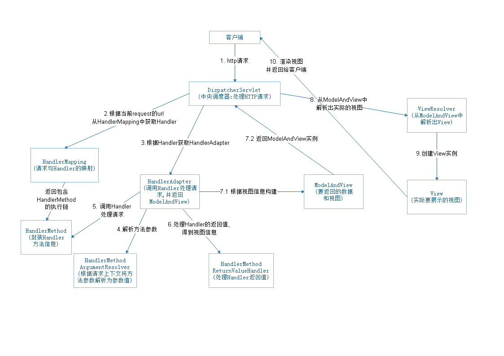

# 带着问题阅读SpringMVC源码

Spring MVC是Spring基于MVC(model-view-controller)架构的web框架。Spring MVC是围绕`DispatcherServlet`设计的，核心组件有：`DispatcherServlet`,`HandlerAdapter`,`HandlerMethod`,`Controller`,`ModelAndView`,`ViewResolver`,`HandlerMapping`。

- DispatcherServlet：处理HTTP请求的中央控制器，调用其他组件来处理请求。

- HandlerMapping：处理器映射器，将请求URL与Handler进行映射。

- HandlerAdapter：处理器适配器，帮助DispatcherServlet调用映射到请求的Handler。

- HandlerMethodArgumentResolver: 方法参数解析

- HandlerMethod：处理器方法，封装Handler的方法信息。

- ViewResolver：视图解析器，将基于字符串的逻辑视图名称解析真实的视图。

- Handler：处理器，通常为开发者定义的Controller。

## Spring MVC处理请求的流程

1. 客户端发起一个HTTP请求到服务器；

2. 

以下内容是基于注解方式配置进行解答：

- [问答-HandlerMapping](QA-HandlerMapping.md)
- [问答-HandlerAdapter](QA-HandlerAdapter.md)
- [问答-SpringMVC如何解析方法参数](QA-SpringMVC如何解析方法参数.md)
